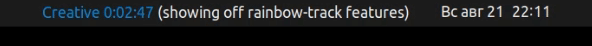
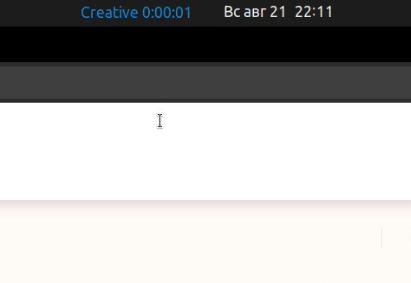
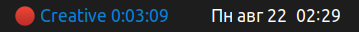
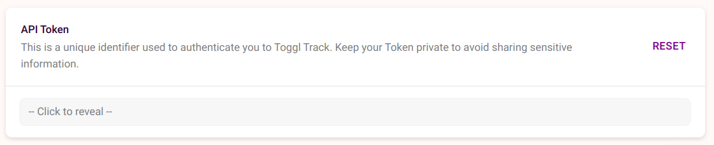
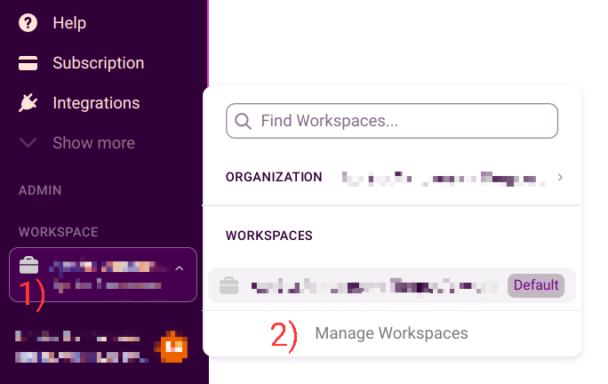
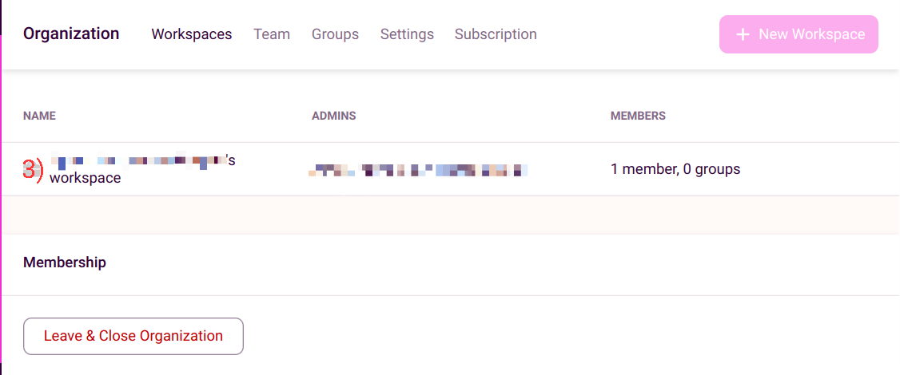
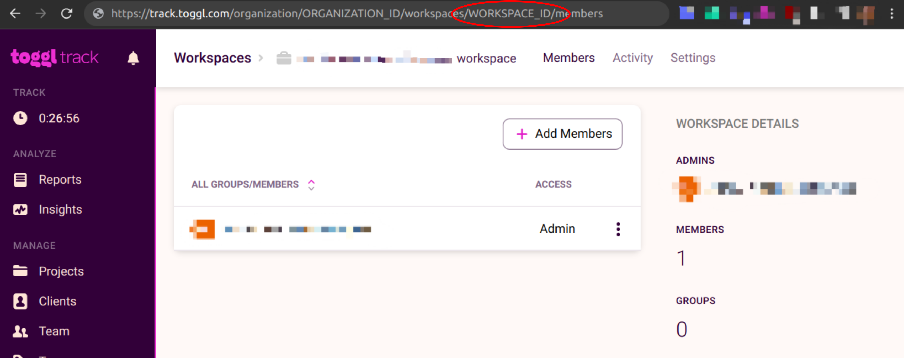

# Rainbow track
GNOME shell extension for smooth two-click time tracking with Toggl Track.

Built with the purpose of making time tracking on Linux a smoother experience.

Built on top of [Argos](https://github.com/p-e-w/argos).

# Features

1) Display your current timer in the GNOME topbar



2) Stop your current timer, or start a new one with just two clicks



3) "No connection" indicator



Known limitations:

In the current version, it is impossible to set tags or a description when starting a new timer. The only configurable 
property of the new timer is its project.

# Installation

### 1) Install Argos.
Install Argos following the [instructions](https://github.com/p-e-w/argos#installation).

### 2) Install dependencies

Rainbow Track requires python3 to run, with the `requests` module installed

1) Make sure that you have `python3` and `pip` installed

2) run `pip install requests`

Additionally, make sure, that you have `curl` installed.
You can check it by running `curl -V` in the terminal.


### 3) Installing Rainbow track

1) Clone this repository. One possible location to clone this repository to is `~/.config/argos/`, however, you can clone it wherever you want

```
cd ~/.config/argos/
git clone "https://github.com/ArtemPt239/rainbow-track"
```

2) Create config:
   1) Create config file
   ```
   cd PATH_TO_THE_CLONNED_REPO
   cp config.json.default config.json
   ```
   2) [Obtain](#Obtaining-Toggl-Track-API-token-and-workplace-id) Toggl Track API token and workplace id
   
   3) Add them to the config file created at step 2.i

3) Create symlink from Argos directory (located at `~/.config/argos`) to the rainbow-track.py:
```
cd ~/.config/argos
ln -s PATH_TO_THE_CLONNED_REPO/rainbow-track.py rainbow-track.c.1s.py
```
Note: **it is important to specify this exact name for the symlink**, because Argos uses this name to determine update 
frequency and position of the extension button on the topbar.
Alternatively, you can name the symlink `rainbow-track.l.1s.py` to place the extension button on the left side of the 
topbar, or `rainbow-track.r.1s.py` to place the extension button on the right side of the topbar.

# Obtaining Toggl Track API token and workplace id:

### Obtaining Toggl Track API token

1) Go to https://track.toggl.com/profile
2) Scroll to the bottom of the page



3) Click "click to reveal" and copy your API token

### Obtaining workplace id:

1) Go to the bottom of the sidebar and click the workspace icon
2) In the opened popup click "Manage Workspaces"



3) Click the name of your personal workspace



4) Workspace id will be a part of the opened url. Copy it




